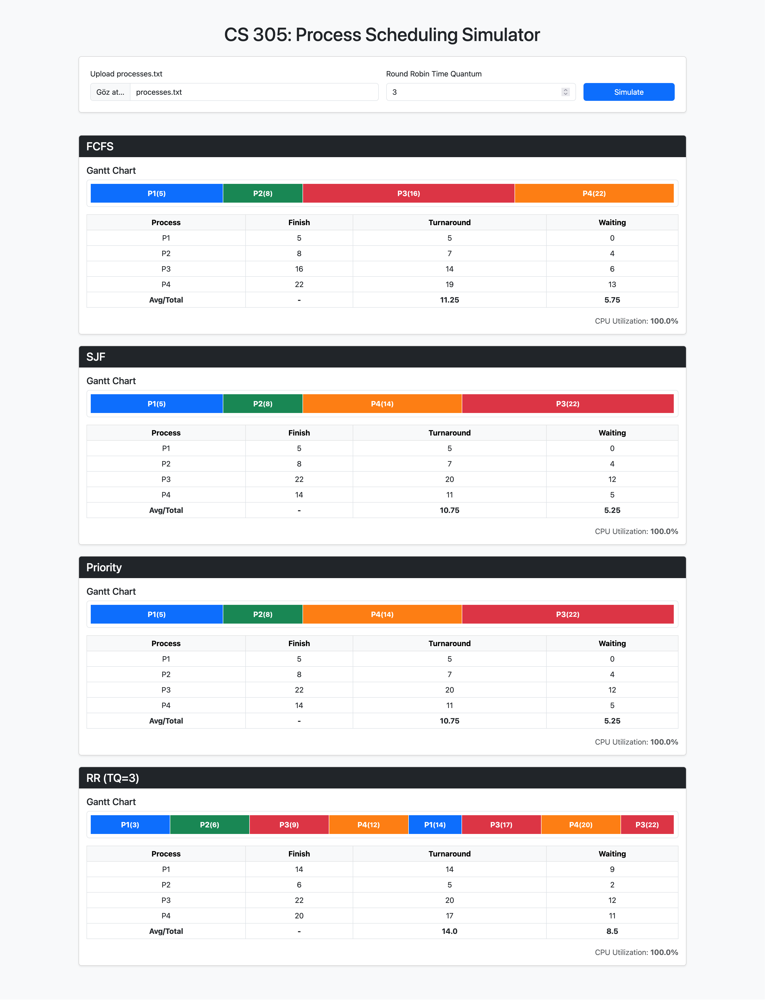

## 🎓 University of Turkish Aeronautical Association
### 💻 Computer Engineering – CS 305: Operating Systems
### 🧭 Assignment: Process Scheduling Simulator

This project is a containerized web application that simulates classic CPU scheduling algorithms (FCFS, SJF, Priority, Round Robin) using a web-based interface built with FastAPI and Jinja2.  
Users can upload a process definition file, run multiple algorithms in parallel, and visualize:
- 📊 Gantt charts for each algorithm
- 🧾 Per‑process metrics (finish time, turnaround time, waiting time)
- 📈 Average turnaround/waiting times and CPU utilization

### 🚀 Quick Start (Docker)

You can run the entire simulator using Docker without installing Python dependencies manually.

1. Open a terminal in the project root.
2. Run:
   ```bash
   docker compose up --build
   ```
3. After the container starts, open your browser and go to:
   - `http://localhost:8080`

> 🧩 Note on Docker/Compose commands  
  
> - If you try `docker compose up --build` and see `unknown flag: --build`, your Docker CLI doesn’t have the new Compose v2 plugin; install/update Docker Desktop to get `docker compose v2`).

### 📄 Input File: processes.txt

- A sample `processes.txt` file is provided in the project root.
- **Format** (no header, one process per line): `PID, arrival_time, burst_time, priority`
- **Example**:
  ```text
  P1,0,5,2
  P2,1,3,1
  P3,2,8,4
  P4,3,6,3
  ```

- On the web UI:
  - You can directly upload the existing `processes.txt` in the project directory to quickly simulate the default test.
  - Or you can edit/create your own `processes.txt` (same format) and upload it to simulate your own scenarios.

### Dashboard View
